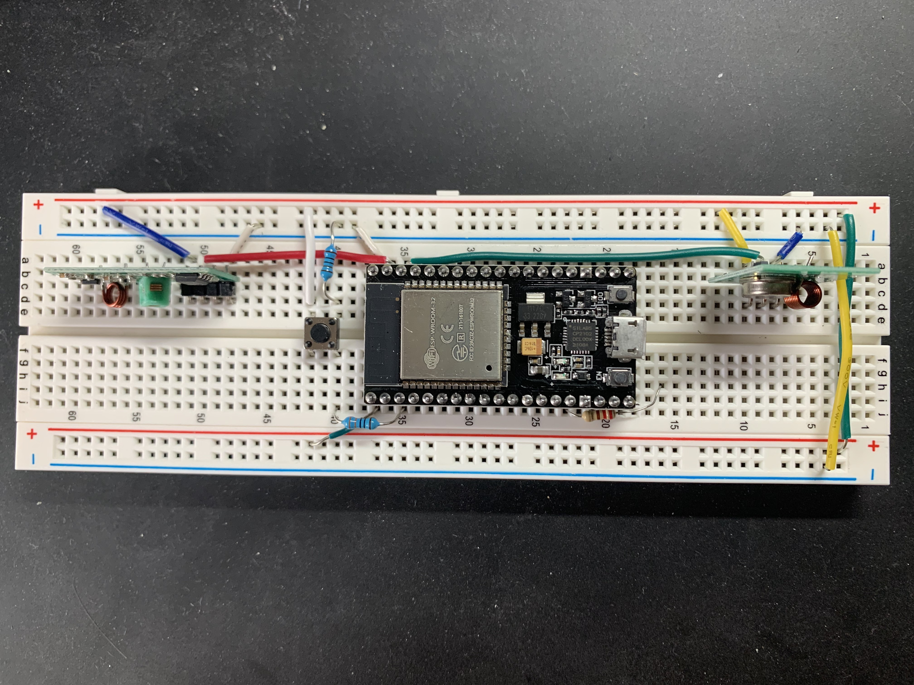

# Connecting a tower fan to Home Assistant

Date: 2023-01-15

The fan: https://www.amazon.com/Oscillating-Cooling-Settings-Portable-Children/dp/B07ZYTMQ2V/

## IR approach

Since the fan already uses an IR remote, I recorded its signals and was able to play them back. This would let me set up the IR transmitter in a central place, where Home Assistant MQTT messages could trigger the IR signals.

<p align="center">

</p>

See `esphome/remotecontrol.yaml` for the full configuration:

```yaml
remote_receiver:
  pin: 22
  dump: all

remote_transmitter:
  pin: 23
  # Infrared remotes use a 50% carrier signal
  carrier_duty_percent: 50%

button:
  - platform: template
    id: fan_power
    name: Fan Power
    on_press:
      - remote_transmitter.transmit_pronto:
          data: "0000 006D 0032 ..."
```

However, the IR receiver needed the transmitter to be exactly in its line of sight. Since I move the fan around, and it also can spin, this wouldn't work. Other options:

- An IR blaster might've solved this, but I wasn't optimistic. A naive version with a bunch of IR diodes didn't help.
- Taping the IR transmitter to the outside of the fan right by the receiver, but I would've also needed to run down a power wire, which would be messy.
- Making the IR receiver stick further out from within the fan, broadening its field of view.

The last option seemed most promising, but since it'd still sit inside the fan and on only one side, it didn't seem like it'd reliably receive signals after being moved around.

## Wifi approach

Wifi would have the benefit of not requiring a central transmitter within the same room. It'd also mean that I could use the same approach for other devices not using IR. And, IR remotes can occasionally trigger devices by different manufacturers because of overlap in the signals, so Wifi would avoid accidentally affecting another device.

I used screwdrivers to pry open the fan casing, and opened up the circuitry. Searching for FSTY001, FYCB620, E123995, FZ10-19JR, and other identifiers turned up a few results.

<p align="center">


</p>

<p align="center">


</p>

Notably, now that the IR receiver was out of the casing, it was very forgiving of any direction for IR signals. I added wires to replace the mechanical switches with transistors. The fan's VCC was conveniently 5V.

<p align="center">

</p>

See `esphome/fan.yaml` for the full configuration:

```yaml
switch:
  - platform: gpio
    pin: 23
    id: fan_power_switch
    name: "Fan Power Switch"
    on_turn_on:
      - delay: 200ms
      - switch.turn_off: fan_power_switch
```

This worked great when using a 5V wall adapter. However, when using the fan's VCC and GND, the voltage dropped from 5V to 4.7V, and the board wouldn't boot correctly. I tried:

- Adding a voltage regulator to bring the voltage to 3.3V. The voltage was stable, but I think the board was still pulling too much current
- Measuring the actual current draw with a multimeter, but even with the wall adapter, I couldn't successfully see the board boot. Perhaps the multimeter was dropping too much voltage. From reading online, it seemed the Wifi usage draws around 200mA, give or take a few hundred depending different conditions.
- ADding some 2200uF capacitors near VCC and GND, but this still wasn't allowing the board to boot up. It's possible I wasn't hooking up the capacitors correctly.
- Drawing power from other areas of the fan's circuit, but this began to feel unsafe. I also couldn't find any easy connections for more than 5V.
- Configuring some Wifi options on ESPHome, like `power_save_mode`, `fast_connect`, and others.

I also considered running another power cable internally up the fan only to my circuit, so that the fan would need two wall outlets. This would've meant a lot more work with the fan internals, and felt inelegant anyway.

I finally concluded that I couldn't easily get the current I needed for Wifi from the fan's board.

## 433MHz RF approach

RF needs less power than Wifi, with some online reading suggesting less than 10mA, far less than the 200mA of Wifi. I could have a central RF transmitter in a closet somewhere, and could use that to send signals to multiple devices.

From reading online, it seems fine to transmit on 433MHz without a HAM license as long as it's for personal use and I'm not frequently polling data over a large area.

I found that connecting to the ESP32 via USB somehow added noise to the RF receiver, but powering through the wall adapter, or through the fan's 5V VCC, worked fine. However, this only worked when the ESP32 was controlling both the receiver and the transmitter. When using separate boards, the signal was less reliable. I tried attached some 17cm wires as antennae (based on the quarter wavelength of 433MHz), but this didn't really improve the signal.

<p align="center">

</p>

```yaml
remote_transmitter:
  pin: 22
  # RF uses a 100% carrier signal
  carrier_duty_percent: 100%

remote_receiver:
  pin: 23
  dump: rc_switch
  # Settings to optimize recognition of RF devices
  tolerance: 50%
  filter: 250us
  idle: 4ms
  buffer_size: 2kb
  on_rc_switch:
    then:
      - switch.turn_on: fan_power_switch
      - logger.log: "Received!"

binary_sensor:
  - platform: gpio
    id: transmit
    pin: 36
    filters:
      - delayed_on: 10ms
    on_press:
      - then:
          - remote_transmitter.transmit_rc_switch_raw:
              code: "10000101010001101100001000100100"
              protocol:
                pulse_length: 252
      - then:
          - logger.log: "Sending transmit"
```

## Back to the IR approach

Having now become familiar with the fan's circuit, I revisited the IR idea and realized I could drill a hole through the top of the fan to expose a wide field of view. I could hook up an IR receiver in parallel with the existing IR receiver to broaden the coverage.

This would require the central IR transmitter in the room, using the `esphome/remotecontrol.yaml` configuration. I ended up reducing the resistor size on the IR emitter to get more current, which in turn increased the range.

<p align="center">

</p>
